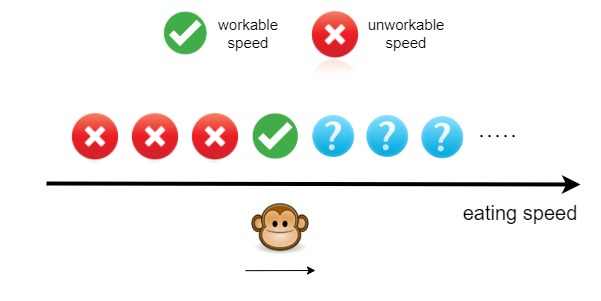
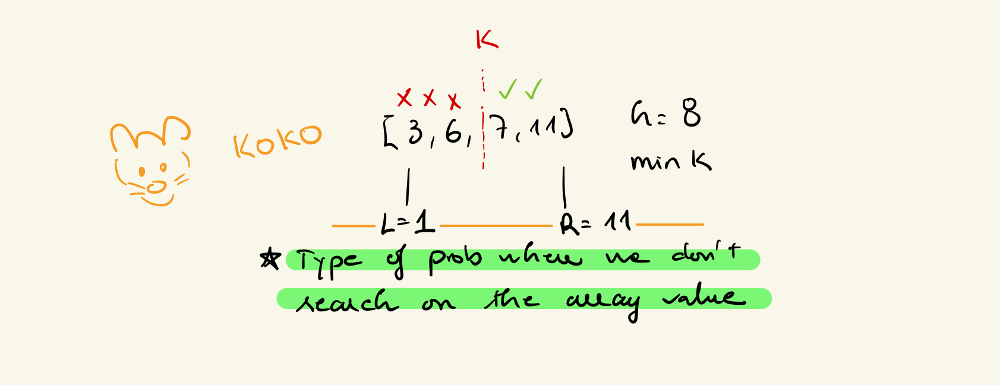

# Koko eat bananas
There are n piles of bananas, the ith pile has piles[i] bananas. The guards have gone and will come back in h hours. <br>

Koko can decide her bananas-per-hour eating speed of k. Each hour, she chooses some pile of bananas and eats k bananas from that pile. If the pile has less than k bananas, she eats all of them instead and will not eat any more bananas during this hour. <br>



⭐️ If Koko can eat all the piles with a speed of n, she can also finish the task with the speed of n+1 
 - If Koko can't finish at n then Koko can't finish at n - 1 <br>

⭐️ If the current speed is workable, the minimum workable speed should be on its left inclusively. If the current speed is not workable, that is, too slow to finish the eating task, then the minimum workable speed should be on its right exclusively. <br>



```py
def minEatingSpeed(piles: List[int], h: int) -> int:
	l = 1 # 1 hour
	r = max(piles)

	while l < r:
		m = l + (r - l)//2
		hour_spent = 0

		for pile in piles:
			hour_spent += math.ceil(pile/m) # eating frequency
		
		if hour_spent <= h:
			r = m
		else:
			l = m + 1
		
	return r
```

> Let n be the length of the input array piles and m be the maximum number of bananas in a single pile from piles <br>
> Time complexity: O(n⋅log⁡m) <br>
> The initial search space is from 1 to m, it takes log⁡m comparisons to reduce the search space to 1. <br>
> For each eating speed middlemiddlemiddle, we traverse the array and calculate the overall time Koko spends, which takes O(n) for each traversal. <br>
> To sum up, the time complexity is O(n⋅log⁡m). <br>