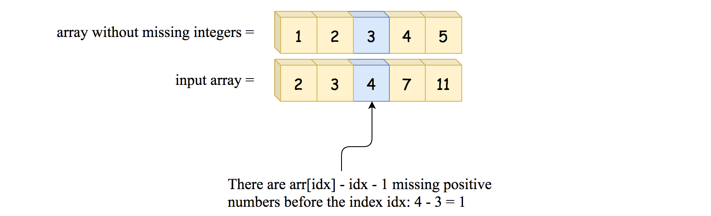
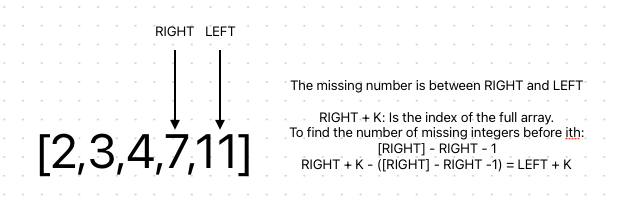
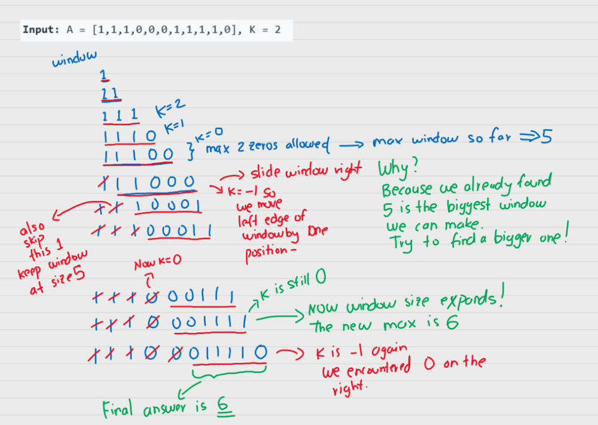
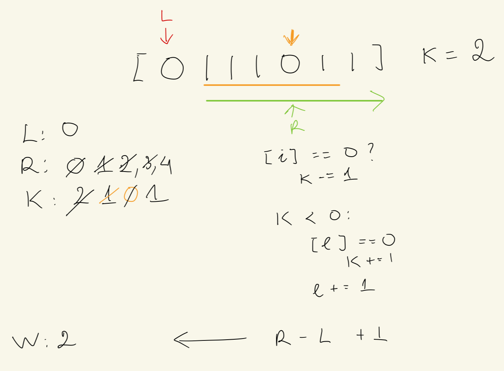

# Kth missing positive number
Given an array of *positive* integers in a strictly increasing order and an integer *k*. Return the K missing number in the array

input: [2,3,4,7,11] <br>
k: 5 <br>
return: 9 <br>
The missing integers [1,5,6,8,9,10,12,13,...] <br>

```python
def naive_approach(nums: List[int]) -> int:
	"""
	Time: O(n)
	Space: O(n)
	"""	
	cache = set(nums)
	i = 1
	while k > 0:
		if k == 0:
			return i
		if i not in cache:
			k -= 1
		i +=1
	return i - 1
```

### Binary search approach
⭐️  input array is sorted. And the sorted input should ring the bell: "let's try to solve it in a logarithmic time using binary search" <br>

> ⭐️ Given [2,3,4,7,11] length = 5. With an array with no missing number <br>
> [1,2,3,4,5]. These are the numbers of the array if there is no missing number from 1 to n.
> So to find the missing number before nums[i]: nums[i] - i - 1


```python
def find_kth_missing_positive(nums: List[int]) -> int:
	"""
	Time: O(logn)
	Space: O(1)
	"""
	left, right = 0, len(nums) - 1

	while left <= right:
		mid = (right + left) // 2
		# num_missing_positive_before_ith
		if nums[mid] - mid - 1 < k:
			# search the missing positive to the right of mid
			left = mid + 1
		else:
			right = mid - 1 
		
	# once we exit the loop: left = right + 1
	# ⭐️ k-th missing is in between nums[left] nums[right]
	# no. of missing integers before right: nums[right] - right - 1
	return left + k
```

# Max Consecutive Ones III
⭐️ Sliding window, keep track of the left and right pointer.
Given a binary array nums and integer k, return the maximum number of consecutive 1s in the array if you can flip k 0s

Input: nums = [1,1,1,0,0,0,1,1,1,1,0], k = 2
Output: 6
Explanation: [1,1,1,0,0,1,1,1,1,1,1]
Bolded numbers were flipped from 0 to 1. The longest subarray is underlined.




```python
class Solution:
    def longestOnes(self, A: List[int], K: int) -> int:
      left = right = 0
      
      for right in range(len(A)):
        # if we encounter a 0 the we decrement K
        if A[right] == 0:
          K -= 1
        # else no impact to K
        
        # if K < 0 then we need to move the left part of the window forward
        # to try and remove the extra 0's
        if K < 0:
          # if the left one was zero then we adjust K
          if A[left] == 0:
            K += 1
          # regardless of whether we had a 1 or a 0 we can move left side by 1
          # if we keep seeing 1's the window still keeps moving as-is
          left += 1
      
      return right - left + 1
```

# All K nodes from target node
⭐️ Because the structure of the node doesn't have a parent pointer, so we must figure out how to associate all nodes to the target node.
⭐️ Therefore, we need to connect all node and store them to a data structure

```python
def distance_k(root: TreeNode, target: TreeNode, k: int):
	# connect all nodes
	conn = defaultdict(list) # using default dict so to not throw key error

	def connect(parent, child):
		nonlocal conn

		if parent and child:
			conn[parent.val].append(child.val)
			conn[child.val].append(parent.val)
			# in order traversal to fill the dict
		if child.left:
			connect(child, child.left)
		if child.right:
			connect(child, child.right)
	
	connect(None, root)

	bfs = [target.val]
	seen = set(bfs)

	# We only need to search at most k step from target
	for i range(k):
		new_level = []
		for start_node in bfs:
			for connected_node in conn[start_node.val]:
				# if not seen
				if connected_node not in seen:
					seen.add(connected_node.val)
		# Update the new bfs queue
		bfs = new_level
		seen != set(bfs)
	
	return bfs


```

# Merge K sorted list

## Brute force
⭐️ We want to get tall the node values, sort them, then create a new linked list
```python
def merge_k_brute_force(lists: Optional[ListNode]):
	"""
	Time complexity: O(k*n) + O(nlogn) = O(nlogn) n is the total number of nodes
	Space complexity: O(n)
	"""
	nodes = []
	for list in lists:
		while list:
			nodes.append(list.val)
			list = list.next
	
	head = current = ListNode(-1)
	for i in sorted(nodes):
		current.next = ListNode(i)
		current = current.next
	
	return head.next
```

## Merge 2 list then merge each list
```python
def merge_lists(lists: Optional[ListNode]) -> ListNode:
	def merge_2_lists(list1: ListNode, list2: ListNode) -> ListNode:
		head = current = ListNode(-1)
		while list1 and list2:
			if list1.val <= list2.val:
				current.next = ListNode(list1.val)
				list1 = list1.next
			else:
				current.next = ListNode(list2.val)
				list2 = list2.next
			current = current.next
		# because one of list 1 or list2 will have remaining nodes
		current.next = list1 or list2
		return head.next
	
	if not list:
		return None
	if len(list) == 1:
		return lists[0]
	
	i = 1
	current = lists[0]
	while i < len(lists):
		current = merge_2_lists(current, lists[i])
		i += 1
	return current
```