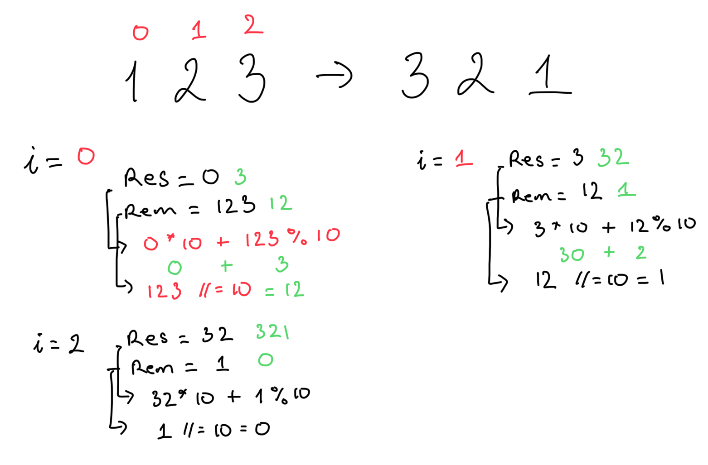
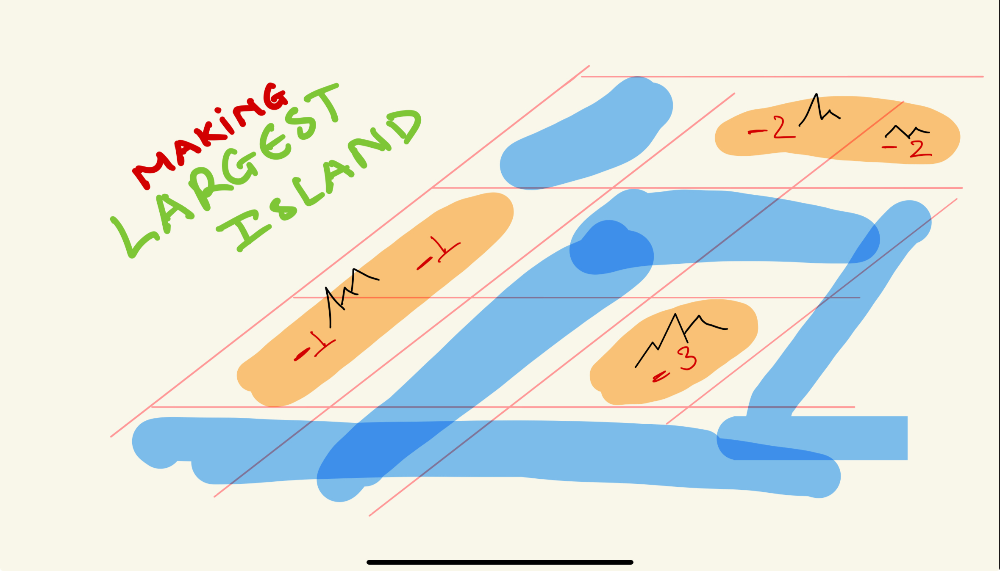
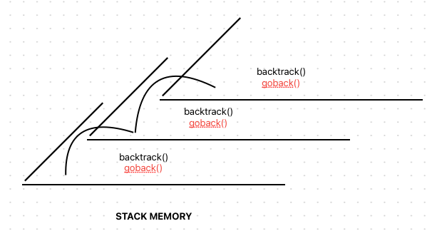
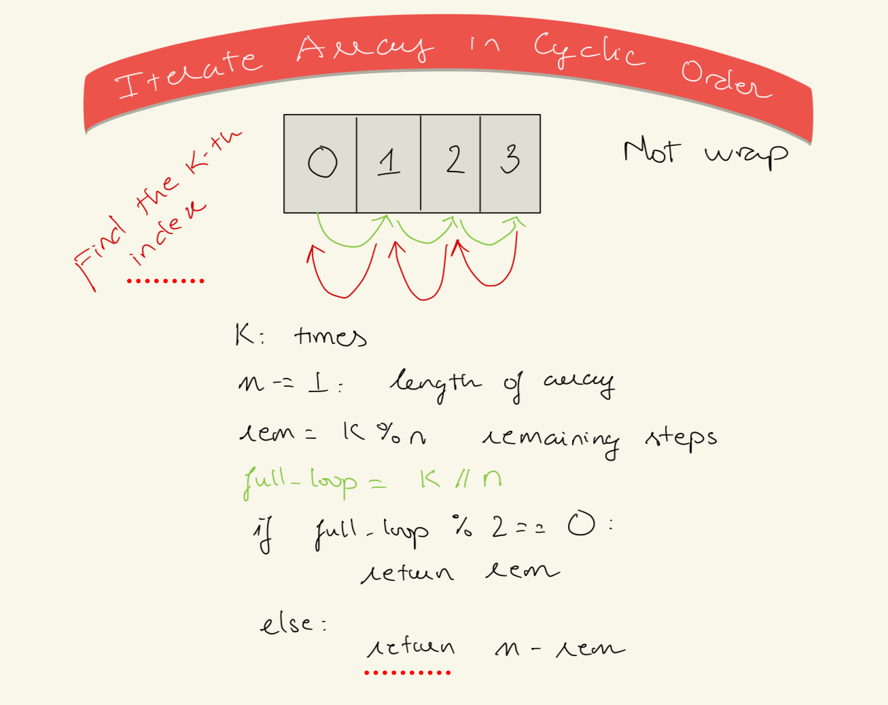
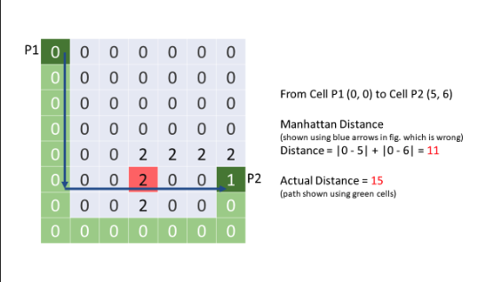

# Reverse the number


Traversing the array from RIGHT -> LEFT
```python
# Time complexity: O(n) n is the number of digits in x
def reverse(x: int) -> int:
  res = 0
  rem = abs(x)
  # Base 10
  while rem:
    res = res * 10 + rem % 10
    rem //= 10
  return -res if x < 0 else res
```

# Re-create the number from left to right from String ↪️

When we need to iterate the string to create a number from characters <br>

```python
def create_number(s: str) -> int:
  n = 0
  for i in range(len(s)):
    n = 10 * n + int(s[i])
    print(f'n: {n}')
  return n
```

# Re-create the number from right to left from String ↩️


```python
def parse_string_from_right(s: str) -> int:
    n = 0
    i = 0
    operand = 0
    for i in range(len(s) - 1, -1, -1):
      print(f'n: {n} | op: {operand} | {s[i]}')
      operand += 10**n * int(s[i])
      n += 1
      print(f'> n: {n} | op: {operand}')
    return operand
```

# Check if a decimal number is palindromic
- If the number is negative then it is not palindromic
- Need to check the most significant bit vs the least significant big, iteratively
- LSB: n mod 10
- MSB: n / 10** (n-1)

```python
def is_palindrome_number(x: int) -> bool:
  if x <= 0:
    return x == 0
  num_digits = math.floor(math.log10(x)) + 1
  msd_mask = 10 ** (num_digits - 1)
  for i in range(num_digits // 2):
    if x // msd_mask != x % 10:
      return False
    else:
      x %= msd-mask # Renove the nost significant digit of x 
      x //= 10 # Renove the least significant digix of x. 
      msd-mask //= 100
```

# Find intersected intervals
You are given two lists of closed intervals, firstList and secondList, where firstList[i] = [starti, endi] and secondList[j] = [startj, endj]. Each list of intervals is pairwise disjoint and in sorted order. <br>

Return the intersection of these two interval lists. <br>

A closed interval [a, b] (with a <= b) denotes the set of real numbers x with a <= x <= b. <br>

The intersection of two closed intervals is a set of real numbers that are either empty or represented as a closed interval. For example, the intersection of [1, 3] and [2, 4] is [2, 3]<br>

⭐️ How do we determine if 2 intervals intersect? <br>

```python
# [s1, e1] vs [s2, e2]
def intersected(listA: List[int], listB: List[int]) -> bool:
  # There are too many check for a intersected
  # Instead we check for the two list not to be intersected
  if listA[1] < listB[0] or listB[1] < listA[0]:
    return False
  return True
```

⭐️ How do we alternatively process each element of the element? <br>
Thinking about binary search. Using 2 pointers. <br>


```python
def intervalIntersection(self, firstList: List[List[int]], secondList: List[List[int]]) -> List[List[int]]:
  result = []
  i, j = 0, 0

  while i < len(firstList) and j < len(secondList):
      list_i = firstList[i]
      list_j = secondList[j]
      if self.intersect(list_i, list_j):
          result.append([max(list_i[0], list_j[0]), min(list_i[1], list_j[1])])
      
      # move pointers
      # ⭐️ if the end list 1 < end of list 2 and we already process the intersected
      # then we should increment i
      if list_i[1] < list_j[1]:
          i += 1
      else:
          j += 1
      
  return result
```

# Find and return the intersect Rectangle
Given the Rectangle can be create with this class <br>

```python
Rectangle(x, y, width, height)
```
There is a list of rectangles, determine if they intersect and return the intersected rectangle

```python
def intersect_rectangles(rectA, rectB):
  def is_intersected(rectA, rectB):
      return (rectA.x <= rectB.x + rectB.w and rectB.x <= rectA.x + rectA.w and
                  rectA.y <= rectB.y + rectB.h and rectB.y <= rectA.y + rectA.h)

  if not is_intersected(rectA, rectB):
    # return an empty rectangle
    return Rectangle(0,0, -1, -1)

  return Rectangle(max(rectA.x, reactB.x),
                   max(rectA.y, rectB.y),
                   min(x1+w1, x2+w2) - max(x1, x2), 
                   min(y1+h1, y2+h2) - max(y1, y2))
```

# Array partition with pointers

Takes an array and index. Rearrange A so that elements less than A[i] (pivot) appears first, followed by elements equals to the pivot and then greater than the pivot <br>
Time complexity: O(n). n is the length of array <br>
Space complexity: O(1) <br>

```python
def dutch_array_partition(nums: List[int], pivot_index: int):
    """
    Takes an array and index. Rearrange A so that elements less than A[i] (pivot)
    appears first, followed by elements equals to the pivot and then greater than the pivot
    """
    pivot = nums[pivot_index]
    smaller, equal, larger = 0, 0, len(nums)
    while equal < larger:
        if nums[equal] < pivot:
            nums[smaller], nums[equal] = nums[equal], nums[smaller]
            smaller += 1
            equal += 1
        elif nums[equal] == pivot:
            equal += 1
        else:
            larger -= 1
            nums[equal], nums[larger] = nums[larger], nums[equal]
```

# Group strings
We can shift a string by shifting each of its letters to its successive letter. <br>
For example, "abc" can be shifted to be "bcd". <br>

⭐️ We want to store the circular diff between one character to another in the SAME string in the hash map <br>
⭐️ This key of the hash map will facilitate the connection between different strings <br>
⭐️ Keep in mind that the character can shift in circular loop <br>

>ex1:
>Input: strings = ["abc","bcd","acef","xyz","az","ba","a","z"]
>Output: [["acef"],["a","z"],["abc","bcd","xyz"],["az","ba"]]

```python
def group_string(strings: List[str]) -> List[List[str]]:
  hash_map = {} # key is the tuple storing the circular difference
  for s in strings:
    key = ()
    for i in range(len(s)-1):
      # ba ord('b') = 98 ord('a') 97 :: diff = 26 - 1 | az ord('z') = 122 ord('a') 97 :: diff = 26 + 25
      # 25 % 26 = 25 | 51 % 26 = 25
      circular_diff = 26 + (ord(s[i+1]) - ord(s[i]))
      key += (circular_diff % 26)
    hash_map[key] = hash_map.get(key, []) + [s]
  return list(hash_map.values)
```

# Random

# Deep copy of lists

# CapOne review
## Range sum
⭐️ Notice that different between the numbers in the smallest ranges is only 1 <br>

>Input: nums = [0,1,2,4,5,7]
>Output: ["0->2","4->5","7"]

```python
class Solution:
    def summaryRanges(self, nums: List[int]) -> List[str]:
        #  0  1  2  3
        # [0, 1, 2, 4] n = 4
        # i = 0: j = 3: 
        # [0,2,3,4,6,8,9]
        n = len(nums)
        if n == 0:
            return []
        
        i = 0
        result = []
        while i < n - 1:
            j  = i + 1
            
            while j < n and nums[j] - nums[j-1] == 1:
                j += 1
            if j - i > 1:
                result.append(f'{nums[i]}->{nums[j-1]}')
                i = j
            else:
                result.append(f'{nums[i]}')
                i += 1
           
        if i == n - 1:
            result.append(f'{nums[i]}')
        
        return result
```

## Binary Tree Pruning


```python
# Definition for a binary tree node.
# class TreeNode:
#     def __init__(self, val=0, left=None, right=None):
#         self.val = val
#         self.left = left
#         self.right = right
class Solution:
    def pruneTree(self, root: Optional[TreeNode]) -> Optional[TreeNode]:
        # BFS tree traversal
        queue = []
        if not root:
            return None
        return root if self.has_one(root) else None

    
    def has_one(self, node: Optional[TreeNode]):
        """
        Returns True if sub tree has 1
        Return False otherwise
        """
        if not node:
            return False
        
        left_has_one = self.has_one(node.left)
        if not left_has_one:
            node.left = None
        right_has_one = self.has_one(node.right)
        if not right_has_one:
            node.right = None
        return node.val or left_has_one or right_has_one
```

## Even odd nodes


```python
class Solution:
   def oddEvenList(self, head: Optional[ListNode]) -> Optional[ListNode]:
       if not head: return None
       
       # odd points to the first node 
       odd = head
       # even points to the second node
       # evenHead will be used at the end to connect odd and even nodes
       evenHead = even = head.next
       
       # This condition makes sure odd can never be None, since the odd node will always be the one before the even node.
       # If even is not None, then odd is not None. (odd before even)
       # If even.next is not None, then after we update odd to the next odd node, it cannot be None. (The next odd node is even.next)
       while even and even.next:
           
           # Connect the current odd node to the next odd node
           odd.next = odd.next.next
           # Move the current odd node to the next odd node
           odd = odd.next
           
           #Same thing for even node
           even.next = even.next.next
           even = even.next
       
       # Connect the last odd node to the start of the even node
       odd.next = evenHead

       # head never changed, so return it
       return head
```

# Making largest island
You are given an n x n binary matrix grid. You are allowed to change at most one 0 to be 1.<br>

Return the size of the largest island in grid after applying this operation.<br>

An island is a 4-directionally connected group of 1s.<br>

❓Check if we can go diagonally <br>



```python
from typing import List

# Time complexity: O(n^2) + O(n^2) <-- from the dfs -->
# Space complexity: O(n^2)

def largest_island(grid: List[List[int]]) -> int:
    """
    Return the largest island that can be made if we can transform 1 cell of sea [i][j] = 0
    to land [i][j] = 1.
    """
    n = len(grid)
    island_id = -1
    island_area = {}

    directions = [(1, 0), (-1, 0), (0, 1), (0, -1)]

    def dfs(grid: List[List[int]], r: int, c: int) -> int:
        nonlocal island_id
        nonlocal directions
        if (0 <= r < len(grid)) and (0 <= c < len(grid[0])) and grid[r][c] == 1:
            # set the island id
            grid[r][c] = island_id

            area = 1

            for r_inc, c_inc in directions:
                new_r = r + r_inc
                new_c = c + c_inc
                area += dfs(grid, new_r, new_c)
            return area
        else:
            return 0

    for m in range(len(grid)):
        for n in range(len(grid[0])):
            if grid[m][n] == 1:
                # kick off dfs
                island_area = dfs(grid, m, n, id)
                island_area[island_id] = island_area
                island_id -= 1

    max_area = 0
    for m in range(len(grid)):
        for n in range(len(grid[0])):
            if not grid[m][n]:
                area = 1
                # check the surrounding cells
                surrounding = set()
                for m_inc, n_inc in directions:
                    new_m = m + m_inc
                    new_n = n + n_inc
                    if (
                        (0 <= new_m < len(grid))
                        and (0 <= new_n < len(grid[0]))
                        and grid[new_m][new_n] != 0
                    ):
                        surrounding.add(grid[new_m][new_n])
                for islandId in surrounding:
                    area += island_area[islandId]
                max_area = max(max_area, area)

    # if the entire grid is 1
    return max_area if max_area > 0 else n**2

```

# Calculator problems
Solve all pattern of the calculator problems <br>

```python
def calculate(expression: str):
    """
    Time: O(n)
    Space: O(n)
    """
    it = 0

    def calc() -> int:
        nonlocal it

        def update(op: str, v: int) -> None:
            if op == "+":
                stack.append(v)
            if op == "-":
                stack.append(-v)
            if op == "*":
                stack.append(stack.pop() * v)
            if op == "/":
                stack.append(int(stack.pop() / v))

        num, stack, sign = 0, [], "+"
        print(f"calc() is called | num: {num}, stack: {stack}, sign: {sign}")

        while it < len(expression):
            print(f"  current iterator {it}: {expression[it]}")
            if expression[it].isdigit():
                num = num * 10 + int(expression[it])
            elif expression[it] in "+-*/":
                update(sign, num)
                num, sign = 0, expression[it]
            elif expression[it] == "(":
                it += 1
                num = calc()
            elif expression[it] == ")":
                update(sign, num)
                return sum(stack)
            it += 1
        update(sign, num)
        return sum(stack)

    return calc()
```

# String frequencies
❓Count the frequencies of the character <br>
❓Count the frequencies of the frequencies <br>

```python
def isValid(s):
    # count the frequency of character
    char_count = {}
    for i in range(len(s)):
        char_count[s[i]] = char_count.get(s[i], 0) + 1
    
    # count the frequency
    freq_count = {}
    for count in char_count.values():
        if count in freq_count:
            freq_count[count] += 1
        else:
            freq_count[count] = 1

    # Step 3: Determine if the string is valid
    if len(freq_count) == 1:
        # All characters occur the same number of times
        return "YES"
    elif len(freq_count) == 2:
        # There are two different frequencies
        keys = list(freq_count.keys())
        print(f'{keys}') # PRINT out the array of character's freq 
        # [2, 1] we know that there is only 1 frequencies that potentially > 1
        if (freq_count[keys[0]] == 1 and (keys[0] - 1 == keys[1] or keys[0] == 1)) or \
           (freq_count[keys[1]] == 1 and (keys[1] - 1 == keys[0] or keys[1] == 1)):
            return "YES"
    return "NO"
```

# Product of Two Run-Length Encoded Arrays
⭐️ Usually straightforward problems involve hidden pattern or intense implementation<br>

⭐️ Update the input array. Keep track of the 'used' frequencies. <br>

 <br>

```python
def find_product(encoded1: List[List[int]], encoded2: List[List[int]]) -> List[List[int]]:
    # Using the brute force implementation
    # would result in memory exceeded
    # ⭐️ Using pointers
    i = j = 0
    res = []

    while i < len(encoded1) and j < len(encoded2):
        val = encoded1[i][0] * encoded2[j][0]
        freq = min(encoded1[i][1], encoded2[j][1])

        if res and res[-1][0] == val:
            # increment the frequency because the 
            # product value is the same
            res[-1][1] += freq
        else:
            res.append([val, freq])
        
        encoded1[i][1] -= freq
        encoded2[j][1] -= freq
        # If the frequencies are 0, move on
        if encode1[i][1] == 0:
            i += 1
        if encoded2[j][1] == 0:
            j += 1
    return res
```
# Building with an ocean view 🌊
There are n buildings in a line. You are given an integer array heights of size n that represents the heights of the buildings in the line.<br>
The ocean is to the right of the buildings. A building has an ocean view if the building can see the ocean without obstructions. Formally, a building has an ocean view if all the buildings to its right have a smaller height.<br>
Return a list of indices (0-indexed) of buildings that have an ocean view, sorted in increasing order. <br>

⭐️ Traverse in reverse <br>
⭐️ Variant: Ocean view from both side => Find the ocean view from the left and right then get the overlapping results <br>

>Input: heights = [4,2,3,1] <br>
>Output: [0,2,3] <br>
>Explanation: Building 1 (0-indexed) does not have an ocean view because building 2 is taller. <br>


```python
def ocean_view_on_right(heights: List[int]) -> List[int]:
    # Iterate from the right. Keep track of max_righ
    max_right = heights[-1]
    ans[len(heights)-1] # the house on the right edge always has ocean view

    for i in range(len(heights)-2, -1, -1):
        if heights[i] > max_right:
            max_right = heights[i]
            ans.append(i)
    return ans[::-1]

def ocean_view_right(heights: List[int]) -> List[int]:
    # iterate from the left and maintain monotonic decreasing stack
    stack = []
    for i in range(len(heights)):
        while stack and heights[stack[-1]] <= heights[i]:
            stack.pop()
        stack.append(i)
    return stack

def ocean_view_left(heights: List[int]) -> List[int]:
    # Maintain a increasing monotonic stack
    stack = []
    for i in range(len(heights)):
        while stack and heights[stack[-1]] >= heights[i]:
            stack.pop()
        stack.append(i)
    return stack 
```

# Validate Binary Search Tree

```python
class Solution:
    def isValidBST(self, root: TreeNode) -> bool:
        
        # Use maximal system integer to represent infinity
        INF = sys.maxsize
        
        def helper(node, lower, upper):
            
            if not node:
				# empty node or empty tree
                return True
            
            if lower < node.val < upper:
				# check if all tree nodes follow BST rule
                return helper(node.left, lower, node.val) and helper(node.right, node.val, upper)
            
            else:
				# early reject when we find violation
                return False
            
        # ----------------------------------
        
        return helper( node=root, lower=-INF, upper=INF )
```

# Word break
> Given a string s, and a dictionary of string wordDict <br>
return true if s can be segmented into a space-separated sequence of one or more dictionary words. <br>
**Note** that the same word in the dictionary may be reused multiple times in the segmentation. <br>


⭐️ Come up with some ugly example input 'leeeeetcoooode' -> set() to track <br>
⭐️ Decision tree -> dfs <br>

```python
def word_break(s: str, wordDict: List[str]) -> bool:
    # memo to store if the current prefix can be segmented using dict
    memo = {} # prefix - boolean
    wordSet = set(wordDict)
    return dfs(s, memo, wordSet)

def dfs(s, memo, wordSet):
    """
    Tries to search among all suffix strings to make sure 
    that all of them can be segmented using the words in the dictionary
    """
    if s in memo:
        return memo[s]
    if s in wordSet:
        return True
    # ⭐️ iterate through the characters
    for i in range(1, len(s)):
        prefix = s[:1]
        suffix = s[1:]
        if prefix in wordSet and dfs(suffix, memo, wordSet):
            memo[prefix] = True
            return True
    memo[s] = False
    return False
```

# Least Recently Used
⭐️ To keep the order in which keys have been used, we can implement a queue. The key at the front of the queue is the least recently used key, and the key at the back of the queue is the most recently used key. When we insert a key for the first time, we put it in the back of the queue.  <br>
⭐️ If we use an array/list to implement the queue, operations will cost O(n). This is because we will frequently be removing elements from arbitrary positions in the list, which costs O(n). <br>
⭐️ Imagine that the linked list is empty and we call put to create a new key-value pair. We create a node for this key-value pair, then we need to set it as both the head and tail (since it's the only node). <br>
What if capacity = 1 and we call put again with a new key? You can imagine the headache that might ensue - we need to delete the only existing node, which means we are deleting both the head and tail. Then we need to add the new node, but since the linked list is empty again, we will be setting the new node as the head and tail again.<br>
The cleanest way to handle the empty list case is by using sentinel nodes. <br>

```python
class Node:
    def __init__(self, key, val):
        self.key = key
        self.val = val
        self.prev = None
        self.next = None
class LRU:
    def __init__(self, capacity: int):
        self.dict = {}
        self.capacity = capacity
        self.head = Node(-1, -1)
        self.tail = Node(-1, -1)
        self.head.next = self.tail
        self.tail.prev = self.head
    
    def add_to_end(self, node: Node) -> None:
        last = self.tail.prev
        last.next = node
        node.prev = last
        node.next = self.tail
        self.tail.prev = node

    def remove_node_front(self, node: Node) -> None:
        node.prev.next = node.next.next
        node.next.prev = node.prev
    
    def get(self, key: int) -> int:
        if key not in self.dict:
            return -1
        node = self.dict[key]
        self.remove_node_front(node)
        self.add_to_end(node)
        return node.val
    
    def put(self, key: int, val: int) -> None:
        if key in self.dict:
            old = self.dict[key]
            self.remove_node_front(old)

        node = Node(key, val)
        self.dic[key] = node
        self.add(node)

        if self.capacity < len(self.dict):
            delete = self.head.next
            self.remove_node_front(delete)
            del self.dict[delete.key]
```

# Next permutation


> Example
> input:   0 1 2 5 3 3 0 <br>
> Output:  0 1 3 0 2 3 5 <br>

```python
"""
Computes the next lexicographical permutation of the specified list in place.
Returns the rearranged as the lowest possible order, if the array is sorted in descending order
"""
def next_permutation(nums: List[int]) -> None:
    # Find the longest non increasing suffix
    i = len(nums) - 1
    while i > 0 and nums[i] <= nums[i-1]:
        i -= 1
    
    if i <= 0:
        # ⭐️ The array is sorted in descending order 5 4 3 2 1
        nums[:] = nums[::-1]
        return
    
    # Find successor to pivot
    j = len(nums) - 1
    while nums[j] <= nums[i-1]:
        j -= 1
    nums[i-1], nums[j] = nums[j], nums[i-1]

    # Reverse the suffix
    nums[i:] = nums[len(nums)-1: i-1: -1]
    
```

# Robot room cleaner | Back tracking
Given the following robot APIs <br>
- move(): 
    + Returns true if the cell in front is open and robot moves into the cell.
    + Returns false if the cell in front is blocked and robot stays in the current cell.
- turnLeft():
    + Robot will stay in the same cell after calling turnLeft/turnRight.
- turnRight():
    + Robot will stay in the same cell after calling turnLeft/turnRight. <br>

⭐️ We don't have access to the grid <br>
⭐️ 0 means block, 1 means move forward <br>
❓ Write an algorithm to clean the room <br>



```python
def clean_room(robot):
    cleaned = set()
    directions = [[0, 1], [1, 0], [0, -1], [-1, 0]]

    def go_back():
        robot.turnRight()
        robot.turnRight()
        robot.move()
        robot.turnRight()
        robot.turnRight()

    def back_track(cell=(0,0), d: int):
        cleaned.add(cell)
        
        for delta in range(4):
            new_d = (d + delta) % 4
            new_cell = (cell[0] + directions[delta][0], cell[1] + directions[delta][1])

            if new_cell not in cleaned and robot.move():
                back_track(new_cell, new_d)
                go_back()
            robot.turnRight()
    
    back_track()
```

# Letter Combination
Given a string containing digits from 2-9 inclusive, return all possible letter combinations that the number could represent. Return the answer in any order.<br>

> Input: '23'
> Output: ["ad","ae","af","bd","be","bf","cd","ce","cf"]

Time: For digits like 2 to 9, which map to 3 or 4 letters, the complexity can be estimated as  O (3^n)  or O(4^n) in the worst case, where n is the number of digits <br>
Space: Overall O(n * k^n) <br>

```python
def letterCombination(digits: str) -> List[str]:
    n = len(digits)
    if n == 0:
        return []
    pad = {'2': 'abc', ...}

    cur =[]
    sol = []

    def backtrack(i=0):
        if len(cur) == n:
            sol.append(''.join(cur[:]))
            return
        for num in pad[digits[i]]:
            cur.append(num)
            backtrack(i+1)
            cur.pop()
    return sol
```

# Iterate the array in cyclic order, not wrap around
⭐️ We want to iterate the array from left to right, then return from right to left - K times <br>


```python
def index_of_child(n: int, k: int) -> int:
    n -= 1 # we iterate from 0 - n-1
    full_loop = k // n
    rem = k % n
    if full_loop % 2 == 0: # even
        return rem # the last index that the pointer will point at
    else:
        return n - rem
```

**Another approach** <br>

```python
def iterate_cyclic(arr: List[int], k: int) -> None:
    n = len(arr) - 1
    it = 0
    direction = -1
    while k > 0:
        if it == n or it == 0:
            direction *= -1
        k -= 1
        print(f'{arr[it]}: {arr[it]}')
        it += direction * 1


iterate_cyclic([1,2,3,4,5], 15)
# 1: 1
# 2: 2
# 3: 3
# 4: 4
# 5: 5
# 4: 4
# 3: 3
# 2: 2
# 1: 1
# 2: 2
# 3: 3
# 4: 4
# 5: 5
# 4: 4
# 3: 3
```

# Shortest distance from all buildings



```python
class Solution:
    def __init__(self):
        self.empty, self.building = 0, 1

        self.direction = [(0,-1), (-1,0), (0,1), (1,0) ]

    def shortestDistance(self, grid: List[List[int]]) -> int:
        buildings = []
        candidate_lands = {} # {position, distance}

        # 1. Find all buildings and candidate empty lands
        for r in range(len(grid)):
            for c in range(len(grid[0])):
                if grid[r][c] == self.building:
                    buildings.append((r, c))

                elif grid[r][c] == self.empty:
                    candidate_lands[(r, c)] = 0

        # 2. Compute min distance from each building to all candidate empty lands
        for building_position in buildings:
            self.min_distance_bfs(candidate_lands, building_position)

        return min(candidate_lands.values()) if buildings and candidate_lands else -1

    def min_distance_bfs(self, candidate_lands: dict, position: (int, int)):
        distance = 0
        visited = set()

        # 1. BFS: this 2-lists bfs traversal makes it possible to avoid storing the distance for each node
        curr_level = [position]
        while curr_level:
            distance += 1

            next_level = []
            # The distance is incremented only after processing all nodes at the current level (by looping through len(queue)), which correctly tracks the distance level in BFS.
            for position in curr_level:
                for direction in self.direction:
                    adjacent_position = (position[0] + direction[0], position[1] + direction[1])

                    if adjacent_position in candidate_lands and adjacent_position not in visited:
                        candidate_lands[adjacent_position] += distance
                        
                        visited.add(adjacent_position)
                        next_level.append(adjacent_position)
            
            curr_level = next_level

        # 2. All empty lands that are not reachable from a building are excluded
        if len(visited) != len(candidate_lands):
            for position in set(candidate_lands.keys()).difference(visited):
                candidate_lands.pop(position)
```


