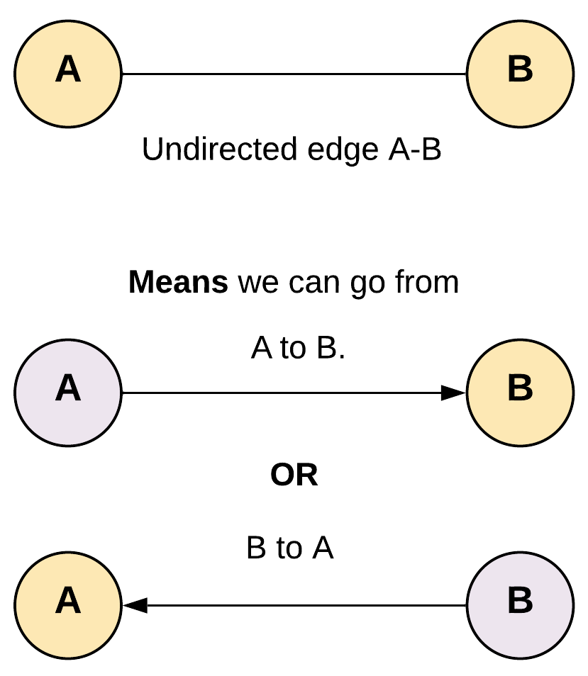

# Sum root to leaf
You are given the root of a binary tree containing digits from 0 to 9 only.
Each root-to-leaf path in the tree represents a number.
For example, the root-to-leaf path 1 -> 2 -> 3 represents the number 123.

⭐️ We need to keep track of the previous integer value


```python
def sum_root_to_leaf(root: Optional[TreeNode]) -> int:
  """
  Return the sum of the integer value from root to leaf
  Assumption: root's val is not 0. No negative
  Time complexity: O(n)
  Space complexity: O(h). H is the height of the tree
  """

  # 
  def dfs(node: Optional[TreeNode], n: int) -> int:
    if not node:
      return 0
    
    n = 10 * n + int(node.val)

    if node.left is None and node.right is None:
      return n

    return dfs(node.left, n) + dfs(node.right, n)
  
  return dfs(root)
```

# Flatten binary tree to linked list
Given the root of a binary tree, flatten the tree into a "linked list":
The "linked list" should use the same TreeNode class where the right child pointer points to the next node in the list and the left child pointer is always null.
⭐️ Following the pre order traversal (root - left - right)
⭐️ Each root has no left child, and the right child is linked to the lowest left child


```python
# Assume the TreeNode
"""
class TreeNode:
  val: int
  left: TreeNode
  right: TreeNode
"""
def flatten(root: Optional[TreeNode]) -> None:
  
  def pre_order(node: Optional[TreeNode]) -> TreeNode:
    """
    Traverse the tree in pre order order
    """
    if not node:
      return None
    if node.left is None and node.right is None:
      return node
    left = pre_order(node.left)
    if left:
      # Update the current node's right child to be the left one
      node.right = left
      current = left
      prev = None
      while current:
        current = prev
        current = current.right
    prev.right = right
    node.left = None
    return node
  
  return pre_order(root)
```

# Convert Binary Search Tree to Sorted Doubly Linked List
Convert a Binary Search Tree to a sorted Circular Doubly-Linked List in place.

You can think of the left and right pointers as synonymous to the predecessor and successor pointers in a doubly-linked list. For a circular doubly linked list, the predecessor of the first element is the last element, and the successor of the last element is the first element.

⭐️ The gist is able to find the first (far left) and the last (far right) node then link them together

```python
"""
class Node:
    def __init__(self, val, left=None, right=None):
        self.val = val
        self.left = left
        self.right = right
"""
def tree_to_doubly_ll() -> 'Optional[Node]':

  # 3 pointers node, fist, last
  def dfs(node: 'Optional[Node]'):
    nonlocal first, last

    if node node:
      return
    
    dfs(node.left)
    if last:
      node.left = last
      last.right = node
    else:
      first = node
    last = node

    dfs(node.right)

  if not root:
    return None

  first, last = None, None
  # connect first, last
  dfs(root)
  first.left = last
  last.right = first

  return first
```

# Clone graph
⭐️ In summary, BFS generally uses more memory than DFS because BFS must store all nodes at the current level before proceeding to the next level, while DFS only needs to store the nodes along the current path.
⭐️ To avoid getting stuck in a loop we would need some way to keep track of the nodes which have already been copied. By doing this we don't end up traversing them again.

```python
class Node:
  def __init__(self, val = 0, neighbors = None):
    self.val = val
    self.neighbors = neighbors
  
  def clone_graph(node: Optional['Node']) -> Optional['Node']:
    old_to_new = {}
    def dfs(node):
      # We use the hash map | key: is the original node, value is the copy
      nonlocal old_to_new

      if node in old_to_new:
        return old_to_new[node]
      
      copy = Node(node.val)
      old_to_new[node] = copy

      # copy the neighbors
      for n in neighbors:
        copy.neighbors.append(dfs(n))
      return copy
    return dfs(node) if node else None
```