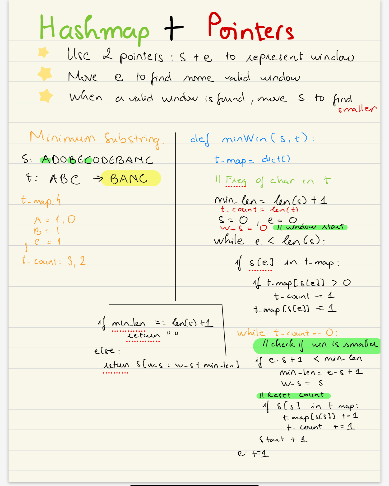

# Minimum window substring
Given two strings s and t of lengths m and n respectively, return the minimum window <br>
substring of s such that every character in t (including duplicates) is included in the window. If there is no such substring, return the empty string "". <br>

- input: S: "ADOBECODEBANC" t: "ABC"
- output: "BANC"



```py
def findSubstring(s: str){
	      hash_map = dict()
        int counter; // check whether the substring is valid
        int begin=0, end=0; //two pointers, one point to tail and one  head
        int d; //the length of substring

        for() { /* initialize the hash map here */ }

        while(end<s.size()){

            if(map[s[end++]]-- ?){  /* modify counter here */ }

            while(/* counter condition */){ 
                 
                 /* update d here if finding minimum*/

                //increase begin to make it invalid/valid again
                
                if(map[s[begin++]]++ ?){ /*modify counter here*/ }
            }  

            /* update d here if finding maximum*/
        }
        return d;
  }
```

```python
def minWindow(s: str, t: str) -> str:
	t_map = dict()
	# find the freq of t
	for ch in t:
		if ch in t_map:
			t_map[ch] += 1
		else:
			t_map[ch] = 0
	
	st = 0
	e = 0
	t_count = len(t)
	min_len = len(s) + 1
	window_start = 0

	while e < len(s):
		if s[e] in t_map:
			if t_map[s[e]] > 0: # the character's frequency is > 0
				t_count -= 1
			t_map[s[e]] -= 1
		
		while t_count == 0: # potentially found the substring
			# We start to look back
			if e - st + 1 < min_len:
				min_len = e - st + 1
				window_start = st
			# reset
			if s[st] in t_map:
				t_map[s[st]] += 1
				if t_map[s[st]] > 0:
					t_count += 1
			st += 1 # move the start pointer
		e += 1 # move the end pointer

	# At the end
	if min_len == len(s) + 1:
		return ""
	else:
		return s[window_start : window_start + min_len]
```